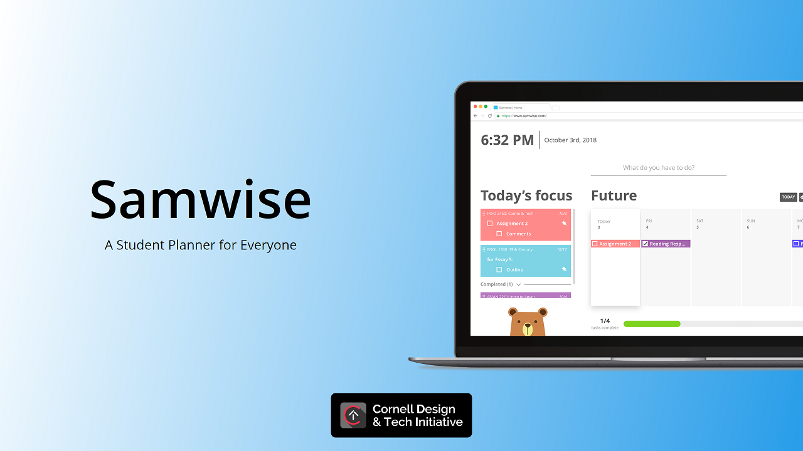

# Samwise

_Last updated **10/20/2019**_

## Contents

- [About](#about)
- [Getting Started](#getting-started)
  - [Contributing](#contributing)
- [Dependencies & Libraries](#dependencies--libraries)
  - [Frontend](#frontend)
- [Documentation](#documentation)
- [Screenshots](#screenshots)
- [Contributors](#contributors)
  - [Since 2016](#since-2016)
  - [Since 2017](#since-2017)
  - [Since 2018](#since-2018)
  - [Since 2019](#since-2019)

## About

A web app to help Cornell students plan their semesters.

## Getting Started

You will need Node.js and Yarn installed on your development machine.

To setup your environment, go into the `frontend` folder and run `yarn install`. Then, run `yarn start` to start a development server or `yarn build` to create a deployment build.

This repository comes with multiple tools to ensure code quality, including a linter and
type checker. Please ensure that they are properly configured with your IDE or text editor.

### Contributing

To maintain code quality, the `master` branch is write-protected. To contribute, please work on your
changes in a new branch and then create a pull request into `master`. When opening a pull request,
make sure you follow the pull request template. Better changelogs make the review process go quicker
and easier for everyone.

All contributed code is expect to follow the
[Style Guide](https://github.com/cornell-dti/samwise/wiki/Style-Guide).

## Dependencies & Libraries

### Frontend

These should be installed automatically by `yarn install`.

- [React](https://reactjs.org/) - a Facebook library for frontend, used for frontend UI.
- [Redux](https://redux.js.org/) - a predictable state container for JavaScript apps, used for state management.
- [React-Redux](https://github.com/reduxjs/react-redux) - a library with bindings between React and Redux.
- [Firebase](https://firebase.google.com) - a serverless service for authentication, database, analytics, and more.
- [React FirebaseUI](https://github.com/firebase/firebaseui-web-react) - a simple sign-in component library for Firebase Authentication.
- [React Calendar](https://www.npmjs.com/package/react-calendar) - a calendar component for React.
- [React Color](https://casesandberg.github.io/react-color/) - a collection of React components for picking colors.
- [React Search Box](https://ghoshnirmalya.github.io/react-search-box/) - a search box component for React.
- [React Toastify](https://fkhadra.github.io/react-toastify/) - a library for emitting toasts in React.

To find the specific version used of each dependency, see [package.json](frontend/package.json).

## Documentation

Check our [wiki](https://github.com/cornell-dti/samwise/wiki) to see all our documentation.

## Screenshots

## Contributors

### Since 2016

- **Alice Zhou*** - Product Manager
- **Justin Tran*** - Front-end Developer
- **Kevin Li*** - Back-end Developer / Designer

### Since 2017

- **Gautam Mekkat*** - Back-end Developer
- **Matthew Epstein** - Product Manager
- **Vivian Shiu** - Designer / Design Lead

### Since 2018

- **Jessica Hong*** - Back-end Developer
- **Michael Xing** - Front-end Developer / Technical Product Manager
- **Michelle Park** - Designer
- **Sam Zhou** - Front-end Developer / Developer Lead

### Since 2019

- **Megan Yin** - Front-end Developer
- **William Evans*** - Back-end Developer
- **Pinxuan Huang** - Front-end Developer
- **Peter Wu** - Front-end Developer
- **Jason Tung** - Back-end Developer

\* Former Contributor

We are a team within the **Cornell Design & Tech Initiative**. For more information, see [our website](https://cornelldti.org/).

