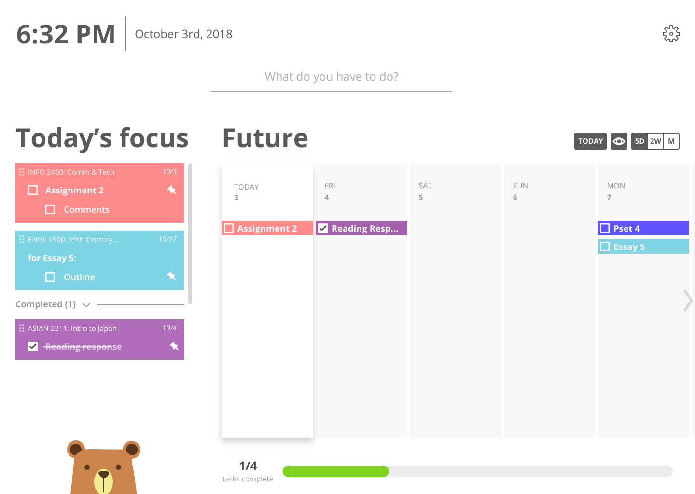

# Samwise

_Last updated **10/06/2019**_.

## Contents

- [Samwise](#samwise)
  - [Contents](#contents)
  - [About](#about)
  - [Getting Started](#getting-started)
    - [Contribution](#contribution)
  - [Dependencies & Libraries](#dependencies--libraries)
    - [Frontend](#frontend)
  - [Documentation](#documentation)
  - [Screenshots](#screenshots)
  - [Contributors](#contributors)
    - [Since 2016](#since-2016)
    - [Since 2017](#since-2017)
    - [Since 2018](#since-2018)
    - [Since 2019](#since-2019)

## About

A web application designed to help Cornell students plan their semesters.

## Getting Started

To run the webapp, go to the frontend folder and run `yarn start`. To build the frontend for
deployment, run `yarn build`.

We use various tools to ensure the quality of our frontend code. They should be installed and
properly configured with your IDE or text editor.

### Contribution

We disabled everyone's ability to directly commit to master branch to ensure code quality. To make
changes to the code, you can create a new branch, have some changes in your branch, and create it
a pull request with good changelog.

You are expected to follow the
[Style Guide](https://github.com/cornell-dti/samwise/wiki/Style-Guide) in your contributed code.

## Dependencies & Libraries

### Frontend

- [React](https://reactjs.org/) - a Facebook library for frontend. We use it for frontend UI.
- [Redux](https://redux.js.org/) - a predictable state container for JavaScript apps. We used it for state management.
- [React-Redux](https://github.com/reduxjs/react-redux) - a library for bindings between React and Redux.
- [Firebase](https://firebase.google.com) - a serverless service for auth, database, etc. We used it for auth, database and analytics.
- [React FirebaseUI](https://github.com/firebase/firebaseui-web-react) - a simple sign-in component library for firebase auth.
- [React Calendar](https://www.npmjs.com/package/react-calendar) - A calendar component for React.
- [React Color](https://casesandberg.github.io/react-color/) - a collection of React components for picking colors.
- [React Search Box](https://ghoshnirmalya.github.io/react-search-box/) - a search box component for React.
- [React Toastify](https://fkhadra.github.io/react-toastify/) - a library for emitting toasts in React.

To know about the specific versions of these dependencies, go to [package.json](frontend/package.json).

## Documentation

Check our [wiki](https://github.com/cornell-dti/samwise/wiki) to see a list of all documentations.

## Screenshots

## Contributors

### Since 2016

- **Alice Zhou** - Product Manager
- **Justin Tran** - Front-end Developer
- **Kevin Li** - Back-end Developer/ Designer (2018)

### Since 2017

- **Gautam Mekkat** - Back-end Developer
- **Matthew Epstein** - Product Manager
- **Vivian Shiu** - Designer

### Since 2018

- **Jessica Hong** - Back-end Developer
- **Michael Xing** - Front-end Developer
- **Michelle Park** - Designer
- **Sam Zhou** - Front-end Developer

### Since 2019

- **Megan Yin** - Front-end Developer
- **William Evans** - Back-end Developer
- **Pinxuan Huang** - Front-end Developer
- **Peter Wu** - Front-end Developer
- **Jason Tung** - Back-end Developer

We are a team within **Cornell Design & Tech Initiative**. For more information, see our website [here](https://cornelldti.org/).

