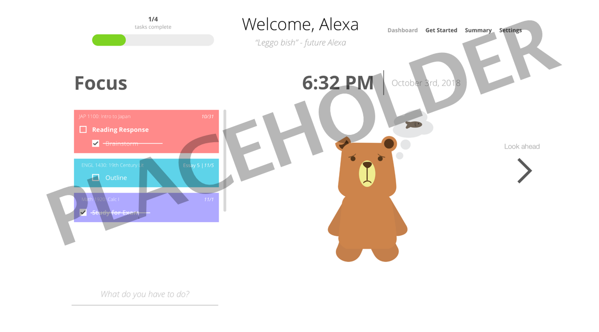

# Project Samwise v1.0
​
#### Contents
  - [About](#about)
  - [Getting Started](#getting-started)
  - [Dependencies & Libraries](#dependencies--libraries)
  - [External Documentation](#external-documentation)
  - [Screenshots](#screenshots)
  - [Contributors](#contributors)
​
## About
A web application designed to help Cornell students plan their semesters.
​
## Getting Started
You will need the latest npm to run the latest version of this app. The app makes use of the following technologies:
​
 * React
   * React version 16.4
 * Redux
   * Redux version 4.0.0

To start the app, navigate to the frontend folder, then run `npm install` first followed by `npm start`.

_Last updated **9/22/2018**_.
​
## Dependencies & Libraries
 * [React (16.4.2)](https://reactjs.org/) - a Facebook library for frontend. We use it for frontend UI.
 * [Redux (4.0.0)](https://redux.js.org/) - a predictable state container for JavaScript apps. We used it for state management.
 * [React-Redux (5.0.7)](https://github.com/reduxjs/react-redux) - a library for bindings between React and Redux.
 * [React Color (2.14.1)](https://casesandberg.github.io/react-color/) - a collection of React components for picking colors.
​
## External Documentation
​
* [Backend API Documentation](https://apiary.io/) - this is an external Apiary documenting the endpoints for our application.
​
## Screenshots

​
## Contributors
​
**Since 2016**
 * **Alice Zhou** - Product Manager
 * **Justin Tran** - Front-end Developer
 * **Kevin Li** - Designer

**Since 2017**
 * **Gautam Mekkat** - Back-end Developer
 * **Matthew Epstein** - Product Manager
 * **Vivian Shiu** - Designer

**Since 2018**
 * **Jessica Hong** - Back-end Developer
 * **Michael Xing** - Front-end Developer
 * **Michelle Park** - Designer
 * **Sam Zhou** - Front-end Developer
​

We are a team within **Cornell Design & Tech Initiative**. For more information, see our website [here](https://cornelldti.org/).

​
